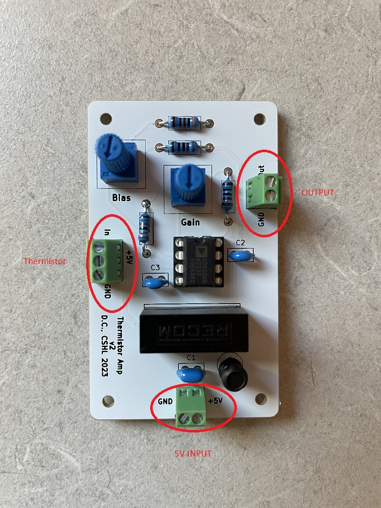

# Thermistor Amplifier

A thermistor amplifier for capturing sniff signals in rodents

## General Use

The circuit takes +5V DC and converts to +/-5V DC for the amp. Using the bias trimmer, you can roughly zero the input from the thermistor, allowing +/-5V swings depending on which side of the sniff you're on. I say roughly because the temperature is never static, so the baseline will drift up and down over the experiment. I considered using a chopper amp to pin the baseline to zero, but there's too much signal loss.  

The Gain trimmer will adjust the level of amplification. The range is not huge, but some thermistor implantations run hotter than others, so it's nice to have a bit of flexibility.

The thermistor gets connected to the 3-position screw terminal. "+5V" is going out from the board into the thermistor, while "In" is the input from the thermistor to the amp. The third position is connected to ground so you can connect cable shielding, which is techinally optional, but very highly recommended.

## Building

UPDATE: By popular demand, this is now made exclusively with through-hole parts, so building is trivial.

### Build Order

- Resistors
- IC Socket
- Capacitors
- Inductor
- Screw Terminals
- DCDC Converter
- Trimmers